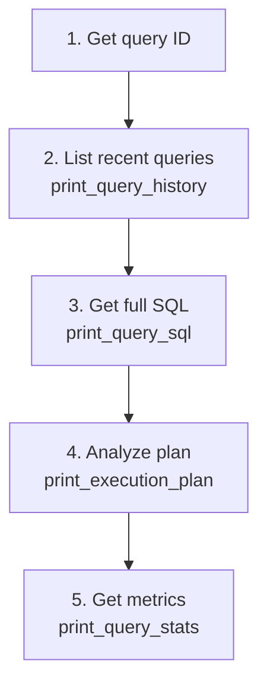
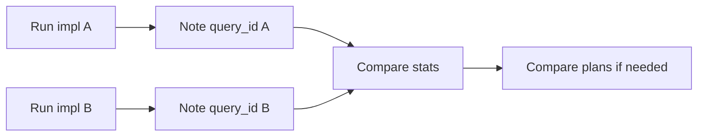

# Using dbt-query-profiler

## Overview

dbt-query-profiler retrieves query history, SQL text, execution plans, and statistics from your data warehouse via `dbt run-operation`. Use it to troubleshoot slow queries, compare implementations, or understand query behavior.

## The Troubleshooting Flow



## Getting Query IDs

Query IDs are required for `print_query_sql`, `print_execution_plan`, and `print_query_stats`.

### Method 1: From print_query_history
```bash
dbt run-operation dbt_query_profiler.print_query_history --args '{table_name: my_model, limit: 5}' --quiet
```
Output includes `query_id` for each result.

### Method 2: From dbt logs with OTEL format

When running dbt (Core or Fusion), use OTEL log format to see query IDs:

```bash
# dbt Core
dbt run --log-format json  # Look for query_id in output

# dbt with OTEL logging (shows all warehouse query IDs)
DBT_LOG_FORMAT=otel dbt run
```

The OTEL format logs each query sent to the warehouse with its ID, making it easy to grab IDs for profiling.

### Method 3: From warehouse UI
Most warehouses show query IDs in their query history UI (Snowflake Query History, BigQuery Jobs, etc.).

## Core Operations

### List Recent Queries
```bash
# Basic: your recent queries
dbt run-operation dbt_query_profiler.print_query_history --quiet

# Filter by table name (partial match)
dbt run-operation dbt_query_profiler.print_query_history \
  --args '{table_name: customers, limit: 10}' --quiet

# Filter by query type
dbt run-operation dbt_query_profiler.print_query_history \
  --args '{query_type: SELECT, limit: 5}' --quiet

# All users (requires elevated permissions)
dbt run-operation dbt_query_profiler.print_query_history \
  --args '{user_name: "", limit: 10}' --quiet
```

### Get Query SQL
```bash
dbt run-operation dbt_query_profiler.print_query_sql \
  --args '{query_id: "01c20db1-060a-bcad-0004-7d832cd6b002"}' --quiet
```

### Get Execution Plan (Actual Stats from Executed Queries)

Use `print_execution_plan` to retrieve the actual execution plan with real statistics from an already-executed query:

```bash
# JSON format (default)
dbt run-operation dbt_query_profiler.print_execution_plan \
  --args '{query_id: "01c20db1-..."}' --quiet

# Text format (more readable)
dbt run-operation dbt_query_profiler.print_execution_plan \
  --args '{query_id: "01c20db1-...", format: text}' --quiet

# Markdown (Snowflake only)
dbt run-operation dbt_query_profiler.print_execution_plan \
  --args '{query_id: "01c20db1-...", format: markdown}' --quiet
```

### Get Query Plan (EXPLAIN-based for SQL)

Use `print_query_plan` to get an EXPLAIN-based plan for arbitrary SQL (estimated, not actual stats):

```bash
# From SQL string
dbt run-operation dbt_query_profiler.print_query_plan \
  --args '{sql: "SELECT * FROM my_table WHERE id = 1"}' --quiet
```

**Note:** `print_query_plan` uses EXPLAIN and shows estimated costs. `print_execution_plan` retrieves actual execution statistics from a query that has already run.

### Getting Query Plans for dbt Models

dbt models contain Jinja that must be compiled to SQL before you can run EXPLAIN. Here's how to get the query plan for a model:

**Step 1: Compile the model**
```bash
dbt compile --select my_model
```

**Step 2: Find the compiled SQL**
The compiled SQL is written to:
```
target/compiled/<project_name>/models/<path>/<model_name>.sql
```

**Step 3: Run EXPLAIN on the compiled SQL**
```bash
# Copy the compiled SQL and pass it to print_query_plan
dbt run-operation dbt_query_profiler.print_query_plan \
  --args '{sql: "SELECT ... (paste compiled SQL)"}' --quiet
```

**Note:** dbt models contain Jinja that must be compiled before running EXPLAIN. There's no way to programmatically get the compiled SQL via macros because dbt's `graph.nodes` only exposes `raw_code` (uncompiled Jinja), not `compiled_code`. The manual compile workflow above is the recommended approach.

### Get Query Stats
```bash
# JSON format (default)
dbt run-operation dbt_query_profiler.print_query_stats \
  --args '{query_id: "01c20db1-..."}' --quiet

# Text format
dbt run-operation dbt_query_profiler.print_query_stats \
  --args '{query_id: "01c20db1-...", format: text}' --quiet
```

## Using --quiet Flag

**Always use `--quiet` with run-operation commands** to get clean output.

Without `--quiet`:
```
Running with dbt=1.7.0
Registered adapter: snowflake=1.7.0
Found 0 models, 0 tests...
{"query_id": "01c20db1-...", "query_text": "SELECT..."}
```

With `--quiet`:
```
{"query_id": "01c20db1-...", "query_text": "SELECT..."}
```

The `--quiet` flag suppresses dbt's startup logs, leaving only the profiler's JSON/text output - much easier to parse or pipe to other tools.

## Comparing Implementations

To compare two approaches to a model:



1. **Run first implementation**, note the query ID from logs
2. **Run second implementation**, note its query ID
3. **Compare stats**:
```bash
dbt run-operation dbt_query_profiler.print_query_stats \
  --args '{query_id: "first-query-id", format: text}' --quiet

dbt run-operation dbt_query_profiler.print_query_stats \
  --args '{query_id: "second-query-id", format: text}' --quiet
```
4. **Compare plans** if needed:
```bash
dbt run-operation dbt_query_profiler.print_execution_plan \
  --args '{query_id: "first-query-id", format: text}' --quiet
```

## Common Arguments

| Argument | Description | Default |
|----------|-------------|---------|
| `table_name` | Filter by table name (partial match) | None |
| `user_name` | Filter by user (empty string = all users) | Current user |
| `query_type` | Filter: SELECT, INSERT, CREATE_TABLE_AS_SELECT, etc. | None |
| `limit` | Number of queries to return | 1 |
| `result_limit` | Lookback depth | 100 |
| `query_id` | Specific query to analyze | Required for sql/plan/stats |
| `format` | Output: json, text, markdown (varies by adapter) | json |

## Platform-Specific Notes

### Snowflake
- Use `format: markdown` for readable plan tables
- Account-level history requires `SNOWFLAKE.ACCOUNT_USAGE` access
- Set `use_account_level_history: true` in vars for cross-user queries
- Filter for dbt model refreshes by query type:
  - Tables: `query_type: CREATE_TABLE_AS_SELECT`
  - Views: `query_type: CREATE_VIEW`
  ```bash
  dbt run-operation dbt_query_profiler.print_query_history \
    --args '{table_name: my_model, query_type: CREATE_TABLE_AS_SELECT, limit: 5}' --quiet
  ```

### BigQuery
- Query plans not available (raises error)
- Uses `INFORMATION_SCHEMA.JOBS_BY_USER` or `JOBS_BY_PROJECT`

### Databricks
- Plans from `system.query.history`
- Unity Catalog required for system tables

### DuckDB
- Requires `CALL enable_logging('QueryLog')` before queries to profile
- Logs are session-scoped (won't see queries from previous sessions)
- Plans via `EXPLAIN ANALYZE` re-execution

### Redshift
- Plans from `stl_explain` system table
- Stats from `svl_query_metrics_summary`

## Troubleshooting

**"No query found"**
- Query may be outside lookback window (increase `result_limit`)
- Wrong user context (try `user_name: ""` with elevated permissions)
- Query not yet in history (some warehouses have latency)

**Query plan not available**
- BigQuery doesn't expose plans
- Some query types don't generate plans

**Permission denied**
- Check warehouse-specific permissions in README
- For all-user queries, need account-level access
